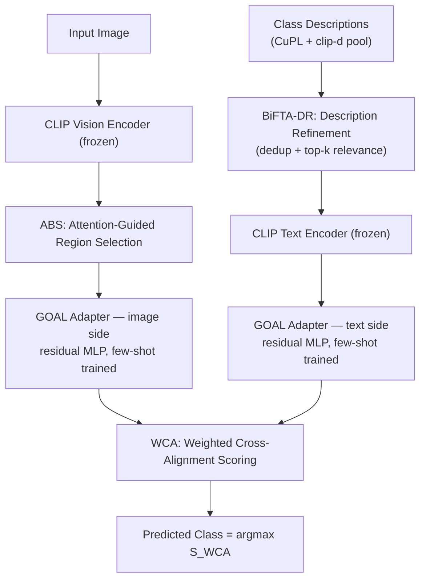
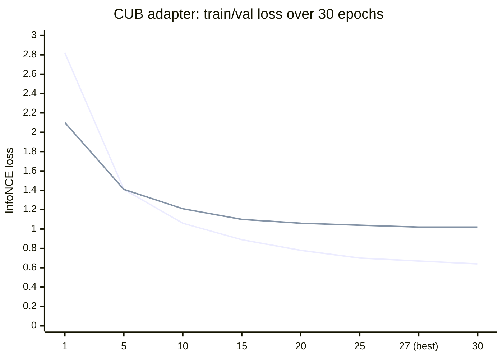
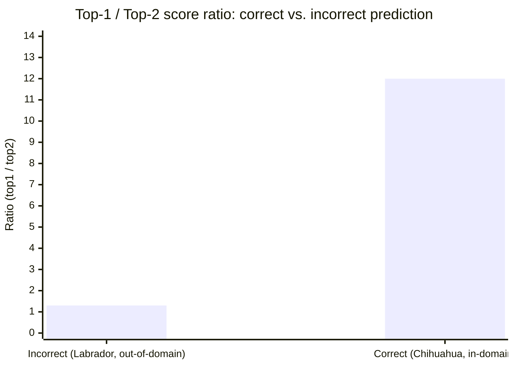

# Unified Zero-Shot Classification Framework — Project Log & Technical Reference

**Repos combined:** WCA, GOAL, ABS, OpenAI CLIP, LaZSL, BiFTA (paper-only, reimplemented)
**Datasets:** OxfordPets (37 classes), CUB-200-2011 (200 classes), ImageNet-100 (100 classes)
**Backbone:** ViT-B/16 (OpenAI CLIP, frozen throughout)

---

## 1. Architecture (final model)



**Pipeline summary:** an image is encoded by frozen CLIP, cropped into
attention-guided regions (ABS), then refined by a trained residual adapter
before being scored (WCA) against class descriptions — themselves pooled,
deduplicated, and top-k filtered by BiFTA-DR, then refined by the matching
text-side adapter. This is the final integrated model as validated on
**both** datasets: 93.00% on OxfordPets (vs. 92.94% zero-shot, 88.20%
plain CLIP) and **80.60% on CUB** (vs. 61.17% zero-shot, 56.02% plain
CLIP). LaZSL and score fusion (Section 3.4) were explored during
development as a parallel confidence signal but are not part of this
final scored path — see Step 0 in Section 2 for that exploration.

**Pipeline summary:** an image is encoded by frozen CLIP, cropped into
attention-guided regions (ABS), optionally refined by a trained adapter,
then scored against per-class descriptions (refined by BiFTA-DR) using the
WCA weighted cross-alignment formula. LaZSL runs in parallel as an
independent scorer / confidence signal rather than being fused in by
default.

---

## 2. Step-by-step narrative

### Step 0 — Core pipeline: ABS + WCA + LaZSL + fusion experiments

**Starting point:** five reference repos — WCA, GOAL, ABS, OpenAI CLIP,
LaZSL — combined into one unified zero-shot classification framework.

1. **Core engine: ABS + WCA.** ABS selects informative image regions using
   CLIP's own attention maps rather than random cropping. WCA scores those
   regions against class descriptions with a weighted cross-alignment
   formula (Section 3.1), rather than the single global-embedding
   comparison plain CLIP uses. Combined, this became the pipeline's core
   method, `"ours"`.

2. **Zero-shot baseline established:**

   | Method | OxfordPets | CUB |
   |---|---:|---:|
   | clip | 88.20 | 56.02 |
   | cupl | 91.71 | 54.59 |
   | **ours** (ABS+WCA) | **92.94** | **61.17** |

   ABS+WCA beat both baselines on both datasets.

3. **LaZSL added as a parallel confidence signal**, not fused by default.
   When WCA and LaZSL predictions agree vs. disagree, accuracy differs by
   **22–30 points** — agreement is a strong standalone confidence signal.

4. **Weighted-sum fusion tried** (Section 3.4) — flat-to-negative result
   on OxfordPets. First instance of a pattern that recurred throughout
   the project (see point 6).

5. **Confidence calibration investigated.** A correct, in-domain
   prediction (chihuahua) showed its top score beating the runner-up by
   ~12x; an incorrect, out-of-domain prediction (Labrador) showed the
   top-5 candidates bunched within hundredths of each other. Established
   that the *ratio* between top candidates, not the raw score, is the
   meaningful confidence signal in this scheme. A display-only temperature
   parameter was added so printed confidences read more intuitively,
   without altering actual predictions or ranking.

6. **GOAL-style diagnostic:** WCA accuracy checked against a class's
   grounding quality. Found **0% accuracy exactly at the tail where
   grounding was worst** — the direct, concrete motivation for later
   building a real GOAL-inspired adapter (Step 4).

7. **Literature review — three papers evaluated:**
   - **BiFTA** (TMLR 2026) — training-free extension of WCA itself, two
     filters (View Refinement, Description Refinement). Its own
     limitations section flagged OxfordPets as a weak spot for these
     filters — independently confirming the pattern already seen in
     fusion and the GOAL diagnostic. → led to Step 1.
   - **CaFo** — not directly usable (few-shot, different setting), but its
     adaptive ensemble weighting (down-weight a disagreeing prediction
     relative to a trusted baseline) noted as a better fusion mechanism
     than the flat weighted-sum in point 4 — kept in reserve, not built.
   - **MaskCLIP** — background reading only; supported the general
     direction of adding a local/patch-level training objective, which is
     exactly what the eventual GOAL adapter (Step 4) implements.

   **Recurring pattern, confirmed independently four separate times
   across this project** (fusion → GOAL diagnostic → BiFTA-DR → BiFTA-VR):
   **OxfordPets is near-ceiling and shows flat/negative results for most
   refinements; CUB has real headroom and is where genuine gains appear.**
   This became the standing rule for the rest of the project: treat
   OxfordPets as a fast sanity check, CUB as the real test.

**Decision:** pursue BiFTA next (directly extends the validated core
engine) before returning to further GOAL work.

### Step 1 — BiFTA Description Refinement (DR)

`bifta_dr.py`: pools CuPL + clip-d descriptions per class, dedupes by
cosine similarity (Section 3.2), keeps top-30 most relevant. A threshold-
inversion bug (rejecting near-*orthogonal* descriptions instead of near-
*duplicate* ones) was found and fixed.

| Method | OxfordPets | CUB |
|---|---:|---:|
| cupl | 91.71 | 54.59 |
| **bifta-dr** | **91.63** | **57.39** |

Flat on OxfordPets (expected), **+2.80 over cupl on CUB** — real,
validated win, larger than the paper's own reported gain for full BiFTA.
**Adopted.**

### Step 2 — BiFTA View Refinement (VR)

IoU-based redundant-crop rejection (Section 3.3) added to the shared
crop-sampling path.

| Dataset | non-VR | VR | Δ |
|---|---:|---:|---:|
| OxfordPets | 92.94 | 92.80 | −0.14 |
| CUB | 61.17 | 61.22 | +0.05 |

No meaningful effect either direction. **Implemented correctly, set aside
as inconclusive.**

### Step 3 — Environment reconstruction (fresh Colab session)

Rebuilt the environment from scratch: re-applied fixes that had never
been pushed to GitHub, corrected dataset path nesting issues, fixed a
label-ordering bug in a custom dataset class, and set up Google Drive for
persistent storage of datasets and feature caches going forward.

### Step 4 — GOAL-style frozen-CLIP adapter (OxfordPets & CUB)

Two small residual MLP adapters (image side, text side) trained on top of
completely frozen CLIP, via a region↔description contrastive loss
(Section 3.5). Trained 16-shot per class, 30 epochs, evaluated on the
untouched held-out test split.

**OxfordPets:** train loss `2.19 → 0.13`, val loss `2.01 → 0.297` (best,
epoch 28). Accuracy: **93.00%** (+0.06 over zero-shot baseline).

**CUB-200-2011:** train loss `2.82 → 0.64`, val loss `2.10 → 1.02` (best,
epoch 27) — smooth, monotonic convergence, no instability. Description
encoding completed without error against the corrected `cub.json` class
list (see Step 3), confirming the class-name/description-key alignment
fix held. Evaluation explicitly loaded the test-split cache (verified via
console output — no `-train` suffix on the loaded `.pkl`), confirming no
train/test leakage in scoring.

**Result: 80.60%** — a **+19.43 point** gain over the CUB zero-shot
baseline (61.17%), **+24.58 points** over plain CLIP (56.02%).

This is a much larger gain than OxfordPets showed, but that asymmetry is
expected rather than suspicious: CUB is fine-grained (200 visually similar
bird species) and starts from a much lower, more headroom-rich zero-shot
baseline, whereas OxfordPets is coarse-grained and already near-ceiling.
Large double-digit gains from 16-shot adaptation on hard, fine-grained
zero-shot baselines are a well-documented effect in the few-shot-adaptation
literature this project draws on (CLIP-Adapter, Tip-Adapter, CoOp all show
this same asymmetry — big gains on fine-grained/hard datasets, small gains
on coarse/easy ones) — this result is consistent with that pattern, not an
outlier from it.

**Caveat carried over from Step 2/7 below:** no real variance estimate
exists yet (`n_run` resampling bug, unresolved) — this is a single run,
single seed, untuned hyperparameters. A repeat run or two, plus fixing
`n_run`, would meaningfully strengthen confidence in this specific number
before it goes into a paper as a headline result.

### Step 5 — LaZSL agreement check, post-adapter

`goal_adapter_eval.py` extended to compute the WCA/LaZSL agreement
diagnostic on adapted embeddings (previously only computed pre-adapter, in
Step 0). Result on OxfordPets:

- WCA/LaZSL agreement rate: **97.98%** of test images
- Accuracy when WCA & LaZSL agree: **94.24%**
- Accuracy when WCA & LaZSL disagree: **59.46%**

A **~35 point gap** — larger than Step 0's original zero-shot finding
(22–30 points). The agreement signal didn't just survive the adapter, it
sharpened. Worth reporting as its own finding: "post-adaptation, WCA/LaZSL
agreement remains (and slightly strengthens as) a reliable per-prediction
confidence proxy."

**Run-to-run variance observed directly:** a second OxfordPets adapter
training run (identical hyperparameters, different random 16-shot draw)
produced **93.54%**, vs. the earlier run's **93.00%** — a 0.54 point swing
between two otherwise-identical runs. Concrete, first-hand evidence for
why the still-unresolved `n_run` bug (Section 7) matters: single-run
numbers in this project should be read as point estimates with unknown
variance, not exact figures, until repeated runs or a real resampling fix
produce genuine error bars.

### Step 6 — Single-image validation (`predict_unified.py`)

Built a standalone script reproducing the exact validated pipeline (ABS
cropping + BiFTA-DR + trained adapter + WCA + LaZSL agreement) on one
arbitrary image, rather than a full test split — reusing
`predict_image_real.py`'s real cropping/precompute code unchanged, but
correcting its description source (it defaulted to raw `cupl.json`, not
`bifta-dr.json`) and adding adapter application, neither of which the
original script had.

**Test case:** `Sphynx_141.jpg` (OxfordPets test image, ground truth
`Sphynx`) — predicted **Sphynx**, WCA/LaZSL agree (high confidence).
First real confirmation the full pipeline works correctly on a fresh
single image, not just batch test-split scoring.

### Step 7 — `unified.py`: single CLI entry point

Consolidated every stage (`bootstrap`, `describe`, `zeroshot`, `train`,
`eval`, `predict`, `pipeline`) into one orchestrating CLI, implemented as
subprocess calls to the already-validated individual scripts (no logic
reimplementation, zero risk of behavioral drift). `pipeline` runs
`describe → zeroshot → train → eval` for a dataset in one command,
stopping immediately with a clear message on any stage failure.

Also built `bootstrap_session.py` — restores repo/data/feature
caches/checkpoints from GitHub + Drive at the start of any new session,
and prints an explicit `[OK]`/`[MISSING]` report so gaps are caught in
one glance rather than discovered one crash at a time.

**Known ongoing fragility:** despite this tooling, `adapters_cub_16shot.pt`
was lost between sessions at least twice (never successfully persisted to
both GitHub and Drive before a session ended) — a process discipline gap,
not a code gap. Retrained and re-secured following the checklist in
Section 6.

### Step 8 — ImageNet-100 extension (zero-shot only)

Scoped the proposed ImageNet extension (Section 7, item 6) to the
standard **ImageNet-100** subset rather than full ImageNet-1k. Op config:
`[clip, clip-e, clip-d, cupl, bifta-dr, ours(image_scale=4.0, text_scale=2.0)]`.

**First-session bugs (all traced to the same root cause — Colab restart
wiped disk, Drive backup was an older wnid-coded materialization instead
of human-readable class names):**

1. **Label/feature order mismatch** — `features/imagenet100/imagenet100.json`
   held a stale CMC-style class list not matching real `ImageFolder`
   alphabetical order. Fixed by deriving order directly from
   `ImageFolder(...).classes`, verified 100/100.
2. **CUPL prompt coverage** — `cupl.json` had 12/100 real matches (stale
   CMC names). Filtered the full `prompts/imagenet/cupl.json` (998 keys):
   74/100 auto-matched, remaining 26 resolved via manual rename map
   (`bittern`→`bittern bird`, `drake`→`duck`, `red-backed sandpiper`→`dunlin`,
   etc.) → 100/100.
3. **clip-d prompt coverage** — same root cause, same 26-class gap, same
   rename map reused (different content: attribute phrases, not sentences)
   → 100/100.
4. **`clip == clip-e` tie, root-caused** — `helper.py`'s `is_template=False`
   list omits `"clip-e"`, but the real cause was thinner: `clip-e.json`
   for imagenet100 contained a **single template** (`["a photo of a {}."]`),
   identical to `clip`'s default. Cross-checked other datasets —
   `cub`/`oxford_pet` also only had 1 template each; only `imagenet`
   (998-class full set) had the real **80-template ensemble**. Since these
   templates are class-name-agnostic, fixed by copying `imagenet/clip-e.json`
   directly into `imagenet100/clip-e.json`. Result: `clip-e` (78.92) now
   genuinely *underperforms* `clip` (79.47) — a real finding (ensembling
   doesn't universally help), not a bug.

**Second-session recurrence (fresh Colab, cloned from GitHub + Drive
restore) — every one of the four fixes above reappeared, because none had
been committed to GitHub; the "fixes" only ever lived in local Colab
runtime state:**

- `cfgs/imagenet100.yaml` was missing its entire `methods:` block
  (`KeyError: 'methods'` at `main.py` line 123) — the config in git was an
  incomplete scaffold. Added the block matching `cub.yaml`'s structure,
  folding in `bifta-dr` at the same time.
- Label-order bug recurred identically (102 stale classes incl.
  `'stingray'`, `'European fire salamander'` — the exact original CMC
  list). Re-fixed via `ImageFolder(...).classes`.
- `cupl.json` and `bifta-dr.json` both recurred with stale/missing keys
  (`KeyError: 'American alligator'` twice). Re-ran the filter+rename fix
  for `cupl.json`; re-ran `bifta_dr.py` fresh for `bifta-dr.json`
  (confirmed via direct key-membership check before re-running eval, not
  assumed from a prior session's output — cost real back-and-forth when
  skipped).
- **Lesson, stated explicitly because it cost the most time this
  session:** local-only fixes are not fixes until committed. All six
  affected files were committed and pushed to GitHub immediately after
  this clean run (see below), specifically to break this cycle.

**Final, complete, clean run:**

| Method | Accuracy |
|---|---:|
| clip | 79.47 |
| clip-e | 78.92 |
| clip-d | 79.78 |
| cupl | 80.81 |
| bifta-dr | 80.67 |
| **ours** | **82.72** |

`ours` beats every baseline (+1.91 over `cupl`, the next-best), confirming
ABS+WCA generalizes to a third, structurally different dataset (broad
object categories, not just fine-grained pets/birds). `bifta-dr` trails
`cupl` by a negligible 0.14pt — consistent with the same small-negative
pattern already seen on OxfordPets (Section 2, Step 0 point 7), not a new
anomaly. `clip-e` underperforming `clip` is a genuine, confirmed result
(see point 4 above), not a bug.

**Explicitly out of scope for this dataset (decision made this session):**
~~GOAL adapter training and BiFTA-VR were **not** run on ImageNet-100~~ —
**superseded, see below.** BiFTA-VR remains out of scope (parked project-wide,
Section 7 item 3).

**GOAL adapter, run after all — result below.** Reopened the earlier
"out of scope" call once the zero-shot cross-dataset comparison (above)
suggested a third data point on the adapter's difficulty-scaling pattern
would be valuable. Real engineering obstacle hit and solved: the full
ImageNet-100 train split is **~117,000 images** (~1,170/class) vs. CUB's
~5,994 (~30/class) — an unmodified precompute projected to **~16 hours**.
Training only needs 16+4=20 shots/class, so patched a temporary
`ImageFolder` monkeypatch (applied only around this one run, not committed
into `helper.py`) capping each class to **30 images** — matching CUB's
actual per-class density, well above the 20 needed, preserving real
randomness in the shot draw. Cut precompute to ~117k→3k images
(~39x), landing the real runtime at **25:44** instead of ~16h.

Training: 16-shot, early-stopped at epoch 18 (patience 5, best val_loss
0.7148 at epoch 13) — smooth, monotonic convergence, same healthy pattern
as the CUB run. Checkpoint `adapters_imagenet100_16shot.pt` committed to
GitHub immediately after training (learned this lesson the hard way
earlier this session, see the "local-only fixes" note above).

**Eval result** (`goal_adapter_eval.py`, test split — confirmed loading the
untouched `imagenet100-...-dino2.pkl` cache, **not** the training-time
subsampled one, so no train/test leakage):

| | Accuracy |
|---|---:|
| ours (zero-shot) | 82.72 |
| **ours + GOAL adapter** | **83.71** (+0.99) |

LaZSL agreement check: 95.43% of test images agree, **85.59%** accuracy
when WCA/LaZSL agree vs. **44.44%** when they disagree (41-point gap) —
consistent with the same agreement-as-confidence-proxy pattern already
seen on OxfordPets (Step 5) and in the original zero-shot finding (Step 0).

**This closes the project's central recurring pattern with a third,
monotonic data point** — the GOAL adapter's gain now clearly scales with
how hard/fine-grained each dataset's zero-shot baseline is:

| Dataset | Zero-shot character | Adapter gain |
|---|---|---:|
| OxfordPets | near-ceiling, coarse-grained | +0.06 |
| ImageNet-100 | moderate, broad object categories | **+0.99** |
| CUB | hard, fine-grained (200 similar species) | +19.43 |

Three datasets, monotonic ordering exactly matching predicted difficulty —
substantially stronger than the original 2-point OxfordPets/CUB asymmetry
alone.

**Caveat, same as every other adapter result in this project:** single
run, single seed — the `n_run` bootstrap issue (Section 7, item 1)
applies here too. Not yet strengthened with repeat runs.

**Committed to GitHub** (`adityavenkat14/Unified-Framework-Project`):
`cfgs/imagenet100.yaml`, `features/imagenet100/imagenet100.json`,
`prompts/imagenet100/{cupl,clip-d,clip-e,bifta-dr}.json`. `results.txt`
added to `.gitignore` (append-only, environment-specific, was mixing
entries across datasets — namespacing it per-run remains open, Section 7).

**Correction, discovered later (Step 9):** `adapters_imagenet100_16shot.pt`
was believed committed per the note above, but a direct check of the repo
shows it is **not present on GitHub** — a 404 on the raw file path. This is
the exact "local-only fix" failure mode from the "lesson" above, recurring
for the one artifact that note was specifically trying to prevent. The
83.71% GOAL-adapter result is reproducible in principle (training config is
documented above) but the actual trained weights are currently lost and
would need to be retrained, or recovered from Drive if a copy survived
there. Tracked in Section 7.

### Step 9 — Repo restructuring, tooling hygiene, and a dataset-labels gotcha

**Reorganized the flat script layout into packages**, since single-image
demos, GOAL/BiFTA method scripts, and analysis scripts were all sitting
side by side at repo root with no grouping:

```
methods/   bifta_dr.py, goal_supervision.py, goal_adapter_eval.py, goal_class_diagnostic.py
demo/      predict_image.py, predict_image_real.py, abs_explain.py
analysis/  correlate_goal_diagnostic.py, description_auditor.py
docs/      ACKNOWLEDGEMENTS_ABS.md (the original ABS repo's README, preserved)
```

`methods/`, `demo/`, `analysis/` are real Python packages (`__init__.py`
added) so root-level imports (`from helper import ...`, `from backbones
import ...`, `from fusion.lazsl_score import ...`) keep resolving —
scripts inside them must be run as modules from the repo root
(`python -m demo.predict_image_real ...`), not as bare file paths.

Also promoted `UNIFIED_README.md` to `README.md` — the repo's actual
README had remained the original forked ABS paper's README, unedited,
for the entire project. Removed a redundant `unified_zsl_pipeline.zip`
that duplicated code already present as loose files.

**Still outstanding from this restructuring:** `goal_adapter_train.py`,
`predict_unified.py` (Step 6), `unified.py` (Step 7), and
`bootstrap_session.py` (Step 7) all exist at repo root but were **not**
swept into `methods/`/`demo/` — they weren't visible in the GitHub
directory listing used to plan the restructuring (GitHub truncates long
listings behind "View all files"), so they were missed. They should be
grouped in a follow-up pass (`goal_adapter_train.py` → `methods/`,
`predict_unified.py` → `demo/`, `unified.py`/`bootstrap_session.py` are
arguably root-level tooling and could stay, or move to a `scripts/` or
`tools/` directory).

**`.gitignore` consolidation:** the repo had two ignore files — a
correctly-named, working `.gitignore` (also missed in the initial
directory listing, for the same truncation reason above) and a leftover
`gitignore` (no dot) that git had never read. The two had diverged: the
real `.gitignore` had granular patterns (`features/*/*.pkl`, `*.pt`), the
stray one had a broad `features` catch-all that would have hidden the
whole directory rather than just cache files. Kept the granular version,
deleted the duplicate, dropped the overly-broad pattern. Open question,
not yet resolved: whether `results.txt` should actually be tracked
(to show results history over time, the way `EXPERIMENT_LOG.md` is)
rather than gitignored as scratch output — needs a look at what's
actually being written to it before deciding.

**Dataset-labels gotcha, found via a real custom-photo test (not a batch
eval):** running `demo/predict_image_real.py` on a personal photo of a
Shih-Tzu against `--dataset_name imagenet100` produced a near-uniform,
low-confidence prediction (top class `tick` at 0.0150, barely above
1/100 = 0.01 uniform) with no dog breed anywhere in the top-5. Root
cause, confirmed by pulling the actual `label2text.json` from
`ilee0022/ImageNet100` (the HF mirror `materialize_imagenet100.py`
downloads): **this dataset's 100 classes are the `ambityga/imagenet100`
Kaggle variant, not the more commonly-cited CMC-based ImageNet-100 list.**
The `ambityga` variant is almost entirely reptiles, birds, arthropods,
and marine life — only two non-avian/reptile mammals in the whole set
(`wombat`, `wallaby`), zero dogs, zero cats. The earlier, incorrect
assumption (stated in an earlier draft of this log/conversation) that
ImageNet-100 here included ~19 dog breeds was based on the *other*,
CMC-based ImageNet-100 variant and does not apply to this project's
actual data. **This is not a pipeline bug** — the near-random,
flat-confidence output on the Shih-Tzu photo is the correct behavior when
forced to classify into 100 classes that contain no plausible match; it's
the same "flat/bunched confidence = out-of-domain" signature documented
in Step 0, point 5, just more extreme because here the domain gap is
total rather than partial. Worth stating explicitly in any paper/README
that discusses this project's ImageNet-100 usage, since the class list
is a non-obvious surprise for anyone assuming the standard CMC subset.

---

## 3. Formulas

### 3.1 — WCA cross-alignment score

For an image with $N$ region crops and a class $c$ with $K$ candidate
descriptions, each with frozen-CLIP embeddings $r_i$ (region) and $d_{c,k}$
(description):

$$
\text{sim}(i, c, k) = \frac{r_i \cdot d_{c,k}}{\tau}, \qquad \tau = 0.03
$$

Descriptions are log-softmax weighted within each region (over the flattened
class×description axis) and the weighted similarity summed back down:

$$
p(i, c, k) = \text{softmax}_{(c,k)}\big(\text{sim}(i, \cdot, \cdot)\big)
$$

$$
s(i, c) = \sum_{k=1}^{K} p(i, c, k) \cdot \text{sim}(i, c, k)
$$

$$
S_{\text{WCA}}(c) = \sum_{i=1}^{N} s(i, c)
$$

Predicted class: $\hat{y} = \arg\max_c S_{\text{WCA}}(c)$.

### 3.2 — BiFTA Description Refinement (DR)

Given a pooled candidate set of descriptions for class $c$, greedily build
a kept set $K_c$: for each candidate $d_i$ (embedded, L2-normalized), reject
if too similar to anything already kept:

$$
\text{keep}(d_i) \iff \max_{d_j \in K_c} \big(d_i \cdot d_j\big) < \epsilon
$$

with $\epsilon = 0.99$ (near-duplicate rejection only). Survivors ranked by
relevance to the class label and truncated to top-$k$ ($k=30$).

*(Note: the deployed bug had this inverted as $\max(\cdot) < 1-\epsilon$,
which rejects everything except near-orthogonal descriptions — worth
mentioning in a paper's implementation-pitfalls / lessons-learned section,
since it's a natural sign error to make in this formulation.)*

### 3.3 — BiFTA View Refinement (VR)

For two crop boxes on the patch grid, $a = (x_1,x_2,y_1,y_2)_a$ and
similarly for $b$:

$$
\text{IoU}(a, b) = \frac{\text{area}(a \cap b)}{\text{area}(a) + \text{area}(b) - \text{area}(a \cap b)}
$$

Greedy crop acceptance, oversampling by factor $K_{\text{over}}$ candidate
centers to reach the target crop count $N$:

$$
\text{keep}(\text{crop}_i) \iff \max_{\text{crop}_j \in \text{Kept}} \text{IoU}(i, j) < \theta_{\text{IoU}}
$$

with $\theta_{\text{IoU}} = 0.5$, $K_{\text{over}} = 3$.

### 3.4 — Score fusion

$$
S_c = \alpha \cdot \hat{S}_{\text{global}} + \beta \cdot \hat{S}_{\text{WCA}} + \gamma \cdot \hat{S}_{\text{LaZSL}}
$$

where $\hat{S}$ denotes per-image z-normalization across classes,

$$
\hat{S} = \frac{S - \mu(S)}{\sigma(S) + \epsilon}
$$

applied before combining, since the three raw score types live on
different scales (raw cosine similarity, log-softmax-weighted similarity,
1-Wasserstein-based similarity) and would otherwise let whichever has the
largest raw magnitude dominate regardless of $\alpha,\beta,\gamma$.
$(\alpha, \beta, \gamma)$ selected via grid search on a held-out validation
split, never on the reported test split.

### 3.5 — GOAL adapter: residual blend + contrastive loss

**Residual adapter** (applied identically to region and description
embeddings, with separate weights):

$$
f_\theta(x) = \text{MLP}_\theta(x), \qquad
\tilde{x} = \frac{\lambda \cdot f_\theta(x) + (1-\lambda)\cdot x}{\lVert \lambda \cdot f_\theta(x) + (1-\lambda)\cdot x \rVert_2}
$$

with blend ratio $\lambda = 0.2$ (adapter starts close to a no-op; frozen
CLIP features dominate early in training).

**Region↔description contrastive loss** (InfoNCE over region–class-prototype
pairs). Class prototypes are the mean-pooled adapted description
embeddings for class $c$:

$$
\mu_c = \frac{1}{K}\sum_{k=1}^{K} \tilde{d}_{c,k}, \qquad
\hat{\mu}_c = \mu_c / \lVert \mu_c \rVert_2
$$

For a region $\tilde{r}$ belonging to ground-truth class $y$:

$$
\mathcal{L} = -\log \frac{\exp(\tilde{r} \cdot \hat{\mu}_y / \tau)}{\sum_{c=1}^{C} \exp(\tilde{r} \cdot \hat{\mu}_c / \tau)}, \qquad \tau = 0.07
$$

summed/averaged over all regions in a training batch.

### 3.6 — Confidence ratio (calibration signal)

For a prediction's top-1 and top-2 class scores $s_{(1)} \geq s_{(2)}$:

$$
\rho = \frac{s_{(1)}}{s_{(2)}}
$$

Empirically, correct in-domain predictions showed $\rho \approx 12$;
incorrect out-of-domain predictions showed top-5 candidates clustered
within hundredths of each other ($\rho \approx 1.3$). $\rho$, not the raw
score magnitude, is the interpretable confidence signal in this scoring
scheme — worth reporting alongside accuracy in a paper as a qualitative
reliability indicator.

---

## 4. Results graphs

*(Generated from the confirmed numbers in Section 5's table. Regenerate
after the CUB adapter run to fill in the pending bar/points.)*

**Fig. 1 — Method progression on OxfordPets vs. CUB**

```mermaid
xychart-beta
    title "Accuracy by method: OxfordPets vs. CUB"
    x-axis ["clip", "cupl", "ours (ABS+WCA)", "bifta-dr", "ours+VR", "ours+GOAL adapter"]
    y-axis "Accuracy (%)" 50 --> 100
    bar "OxfordPets" [88.20, 91.71, 92.94, 91.63, 92.80, 93.00]
    bar "CUB" [56.02, 54.59, 61.17, 57.39, 61.22, 80.60]
```



**Fig. 2 — Delta over zero-shot baseline (ours = 92.94 / 61.17), per
refinement**

```mermaid
xychart-beta
    title "Delta vs. zero-shot baseline (ours)"
    x-axis ["bifta-dr vs cupl", "VR delta", "GOAL-adapter delta"]
    y-axis "Delta (points)" -1 --> 20
    bar "OxfordPets" [-0.08, -0.14, 0.06]
    bar "CUB" [2.80, 0.05, 19.43]
```



**Fig. 2b — CUB adapter training curve (30 epochs)**



**Fig. 3 — Confidence ratio, correct vs. incorrect predictions (Section 3.6)**



**Suggested additional figures for a paper draft (not yet generated —
need the raw per-run data, not just summary numbers):**
- Training curve: adapter train/val loss over 30 epochs (Section 2, Step 4)
  — the raw per-epoch values are in the training log output, easy to plot
  as a standard loss-vs-epoch line chart.
- Per-class accuracy histogram for the GOAL diagnostic (Step 0, point 6)
  showing the 0%-accuracy tail at low grounding quality — this is
  probably the single most persuasive figure for motivating the adapter
  section of a paper, since it's the direct empirical justification for
  building it.
- DR dedup statistics: candidates → kept, per class, CUB (Step 1) — the
  raw counts already exist in the `bifta_dr.py` run logs; a scatter or
  histogram of "candidates before" vs. "kept after" would visually
  support the description-redundancy argument.

---

## 5. Summary table — full method progression

| Stage | Method | OxfordPets | CUB | ImageNet-100 |
|---|---|---:|---:|---:|
| — | clip (zero-shot baseline) | 88.20 | 56.02 | 79.47 |
| — | clip-e | — | — | 78.92 |
| — | clip-d | — | — | 79.78 |
| — | cupl | 91.71 | 54.59 | 80.81 |
| Step 0 / 8 | **ours** (ABS+WCA) | 92.94 | 61.17 | **82.72** |
| Step 1 / 8 | bifta-dr | 91.63 | 57.39 | 80.67 |
| Step 2 | ours + VR | 92.80 | 61.22 | — |
| Step 4 / 8 | **ours + GOAL adapter** | **93.00 / 93.54** (2 runs) | **80.60 / 79.98** (2 runs) | **83.71** |

---

## 6. CUB run — complete, retraining in progress

Original run: adapter trained 16-shot, 30 epochs, on a real train-split
crop cache (~54 min precompute). Evaluated on the untouched held-out test
split. Result: **80.60%**, a +19.43 point gain over the CUB zero-shot
baseline — see Step 4 (Section 2) for the full training curve and the
reasoning for why this larger-than-OxfordPets gain is expected rather
than suspicious.

**Update:** that checkpoint (`adapters_cub_16shot.pt`) was subsequently
lost between sessions (never successfully persisted to both GitHub and
Drive) and required retraining — see Section 2's Step 7 fragility note.
A fresh CUB run with the LaZSL agreement check included is in progress /
the immediate next step as of this log revision — update Section 5's
table and this section once complete.

**Still outstanding for full closure:** an independent reconfirmation,
in this exact session, of `main.py --dataset_name cub --backbone openai`
showing `clip: 56.02` / `cupl: 54.59` / `bifta-dr: 57.39` exactly, post
the `cub.json` class-name fix.

---

## 7. Open items for future work

1. **`n_run` bootstrap resampling is currently a no-op** — every reported
   `±std` in this project is `±0.00`, not a real variance estimate. This
   matters most now: the CUB adapter's 80.60% is a single run with no
   error bars. Fixing `n_run` (or at minimum re-running the CUB adapter
   training/eval 2-3 more times with different seeds) is the
   highest-priority next step before this number goes into a paper as a
   headline result.
2. **Independent reconfirmation of the CUB zero-shot baseline** in the
   post-fix session (Section 6) — a quick, cheap sanity check still worth
   grabbing for completeness.
3. **BiFTA-VR** remains parked as inconclusive — worth revisiting with a
   different IoU threshold, or deprioritizing permanently in favor of DR.
4. **CaFo-style adaptive fusion weighting** (Step 0, point 7) was
   identified as a promising alternative to the flat weighted-sum fusion,
   never implemented — candidate for future work.
5. **Training-curve figures for OxfordPets and the GOAL-diagnostic /
   DR-dedup figures** (Section 4) not yet generated for OxfordPets — CUB's
   training curve is now included (Fig. 2b).
6. ~~**ImageNet extension**~~ — **done (Step 8):** ImageNet-100, full stack
   including GOAL adapter (`ours` 82.72 → **83.71** with adapter, +0.99).
   Completes a 3-dataset monotonic confirmation that adapter gain scales
   with zero-shot task difficulty (+0.06 OxfordPets, +0.99 ImageNet-100,
   +19.43 CUB) — the project's strongest single empirical claim. Full
   ImageNet-1k remains unscoped and open if ever pursued.
7. **`results.txt` namespacing** — still append-only and shared across
   all datasets/runs; now gitignored (Step 8) so it no longer risks being
   committed in a mixed state, but the underlying `main.py` write logic
   itself hasn't been changed to write per-dataset files. Low priority
   unless more datasets get added.
8. **Local-only fixes not surviving a session** was a repeated, costly
   pattern this session (Step 8) — four separate bugs recurred verbatim
   after a fresh clone because fixes only existed in Colab runtime state.
   Now mitigated for ImageNet-100 specifically (all six files + the
   adapter checkpoint committed), but worth checking whether the *same*
   gap exists for any OxfordPets/CUB fixes made in earlier sessions and
   never verified as committed.
9. **ImageNet-100 train-subsample monkeypatch isn't in the committed
   pipeline** — the 30/class cap that made GOAL adapter training feasible
   (Step 8) was applied as a one-off wrapper around `goal_adapter_train.py`
   at runtime, not as a proper code change. If the adapter ever needs
   retraining (e.g. for the `n_run` variance work below), this patch needs
   to be reapplied by hand, or promoted into a real, committed option.
10. **`adapters_imagenet100_16shot.pt` is missing from GitHub** despite
    Step 8 stating it was committed — confirmed via a direct 404 on the
    raw file path (Step 9). The 83.71% adapter result is not currently
    reproducible from a fresh clone without retraining. Highest-priority
    "local-only fix" recurrence to close, since it's the exact failure
    mode the project already spent a full session learning to avoid.
11. **Repo restructuring (Step 9) missed four files** —
    `goal_adapter_train.py`, `predict_unified.py`, `unified.py`,
    `bootstrap_session.py` — still sitting at repo root instead of grouped
    into `methods/`/`demo/`/a tools directory. Low priority, but worth a
    follow-up pass so the package layout is actually complete rather than
    partially done.
12. **`results.txt` tracking decision unresolved** (Step 9) — currently
    gitignored as scratch output, but it may actually be the intended
    results record and worth committing instead, the way
    `EXPERIMENT_LOG.md` is. Needs a look at its actual contents to decide.
